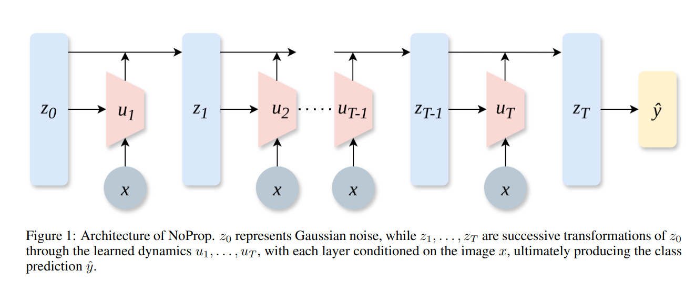

This repository implements the NoProp method for training neural networks using diffusion instead of traditional backpropagation.
The method trains each layer in a network which jointly denoises images and labels. 

## Quick Start

### 1. Install Dependencies

```bash
conda create -n NoProp python=3.11 pip
conda activate NoProp
pip install -r requirements.txt
```

### 2. Train on MNIST, CIFAR10 or CIFAR100

```bash
# Use default MNIST configuration
python train_mnist.py

# Default CIFAR-10 configuration
python train_cifar10.py

# Default CIFAR-100 configuration
python train_cifar100,py

```

### 3. Train with custom configurations

```bash
# Train on CIFAR-100 with custom epochs
python train_universal.py cifar100 --epochs 300

# Override specific parameters
python train_mnist.py --epochs 50 --batch_size 64

# Use custom configuration file
python train_mnist.py --config my_config.yaml

# List available configurations
python train_universal.py --list-configs
```

## Configuration

Experiment configurations are stored in `experiment_configs/` as YAML files:

```yaml
# experiment_configs/mnist.yaml
dataset: "mnist"
batch_size: 128
epochs: 100
learning_rate: 0.001
weight_decay: 0.001
num_layers: 10
# ... more parameters
```

## Implementation Details

### NoProp Method
- Each layer learns to denoise progressively less noisy label embeddings
- Noise schedule: 0.9 → 0.01 across layers
- Clean images provided to all layers (per Figure 1 in paper)
- Independent layer training + classifier training every batch




### Architecture
- 10-layer denoising network (configurable)
- Each layer is a separate `DenoisingModule`
- Final classifier maps denoised embeddings to class predictions

### Training Process
1. Each denoising layer trained independently with layer-specific noise
2. Final classifier trained every batch using full inference pipeline  
3. Separate optimizers for each component
4. Gradient clipping for stability

## Results

| Dataset    | Validation Accuracy (Reproduced) | Validation Accuracy (Paper) |
|------------|-----------------------------------|------------------------------|
| MNIST      | 99.5%                            | 99.5%                        |
| CIFAR-10   | 78.4%                            | 79.25%                       |
| CIFAR-100  | 53.5%                            | 45.9%                        |

## Citation

```bibtex
@article{noprop2024,
  title={NoProp: Training Neural Networks Without Back-propagation or Forward-propagation},
  author={Li, Qinyu and Teh, Yee Whye and Pascanu, Razvan},
  journal={arXiv preprint arXiv:2503.24322},
  year={2024}
}
```

## Project Structure

```
NoProp/
├── src/                              # Source code
│   ├── models.py                     # NoProp network implementation
│   ├── trainer.py                    # Training logic
│   ├── config.py                     # Configuration management
│   ├── dataloaders.py                # Dataset loading utilities
│   ├── utils.py                      # Utility functions
│   ├── logger.py                     # Logging utilities
│   └── __init__.py                   # Package initialization
├── experiment_configs/               # YAML experiment configurations
│   ├── mnistdiffusion.yaml          # MNIST diffusion configuration
│   ├── mnistbackpropagation.yaml    # MNIST backpropagation configuration
│   ├── cifar10diffusion.yaml        # CIFAR-10 diffusion configuration
│   ├── cifar10backpropagation.yaml  # CIFAR-10 backpropagation configuration
│   ├── cifar100diffusion.yaml       # CIFAR-100 diffusion configuration
│   └── cifar100backpropagation.yaml # CIFAR-100 backpropagation configuration
├── tests/                           # Test suite
│   ├── test_config.py               # Configuration tests
│   ├── test_models.py               # Model tests
│   ├── test_dataloaders.py          # Data loading tests
│   ├── test_utils.py                # Utility tests
│   ├── test_integration.py          # Integration tests
│   └── __init__.py                  # Test package initialization
├── training_logs/                   # Training logs and metrics
│   ├── README.md                    # Documentation for logs
│   └── [timestamp]_*.json/csv       # Training logs, configs, and metrics
├── checkpoints/                     # Model checkpoints
│   ├── best_*.pt                    # Best model checkpoints
│   ├── final_*.pt                   # Final model checkpoints
│   └── test_checkpoints/            # Test checkpoints (isolated)
├── data/                            # Dataset storage (created automatically)
│   ├── MNIST/                       # MNIST dataset files
│   ├── cifar-10-batches-py/         # CIFAR-10 dataset files
│   └── cifar-100-python/            # CIFAR-100 dataset files
├── graphs/                          # Performance comparison graphs
│   ├── MNISTcomparison.png          # MNIST results visualization
│   ├── CIFAR10comparison.png        # CIFAR-10 results visualization
│   └── CIFAR100comparison.png       # CIFAR-100 results visualization
├── log_analysis/                    # Log analysis utilities
│   ├── README.md                    # Log analysis documentation
│   └── compare_logs.py              # Log comparison script
├── train_mnistdiffusion.py          # MNIST diffusion training script
├── train_mnistbackpropagation.py    # MNIST backpropagation training script
├── train_cifar10diffusion.py        # CIFAR-10 diffusion training script
├── train_cifar10backpropagation.py  # CIFAR-10 backpropagation training script
├── train_cifar100diffusion.py       # CIFAR-100 diffusion training script
├── train_cifar100backpropagation.py # CIFAR-100 backpropagation training script
├── test_logging.py                  # Logging test script
├── pytest.ini                      # Pytest configuration
├── requirements.txt                 # Python dependencies
├── Title.png                        # Project title image
└── NoProp:TrainingNNWithoutBackPropagation.pdf # Reference paper
```